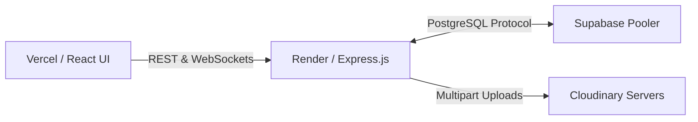

# Deployment Guide

## 1. Database — Supabase
1. Create a project at [Supabase.com](https://supabase.com).
2. Go to Settings → Database → **Connection string (URI)** and copy it.
3. In your local terminal, update your `backend/.env` with that `DATABASE_URL`.
4. Run `node seed.js` in your local terminal. *This will securely connect to Supabase, automatically build all production tables, and optionally seed it with test accounts.*

## 2. Cloudinary
Sign up at cloudinary.com, get your Cloud Name, API Key, and API Secret. Adding these to your backend allows real-time PDF/Document uploads inside the Chatbox and Files tabs.

## 3. Backend — Render
1. Push your repository to GitHub; connect it at [Render](https://render.com) → New Web Service.
2. Root directory: `backend` | Build: `npm install` | Start: `node server.js`
3. Add these Environment variables:
   ```
   PORT=5000
   NODE_ENV=production
   DATABASE_URL=<Supabase URI>
   JWT_SECRET=<random string>
   JWT_EXPIRES_IN=7d
   CLOUDINARY_CLOUD_NAME=...
   CLOUDINARY_API_KEY=...
   CLOUDINARY_API_SECRET=...
   CLIENT_URL=https://your-frontend.vercel.app
   ```

## 4. Frontend — Vercel
1. Go to [Vercel](https://vercel.com) → New Project → Import your repository.
2. Root directory: `frontend` | Build: `npm run build` | Output directory: `dist`
3. Important: Add this Environment Variable so the UI knows where the Render server is:
   - Name: `VITE_API_URL`
   - Value: `https://adtu-backend.onrender.com` 
4. The frontend will natively pull this variable using `import.meta.env.VITE_API_URL`.

## Architecture Flow

